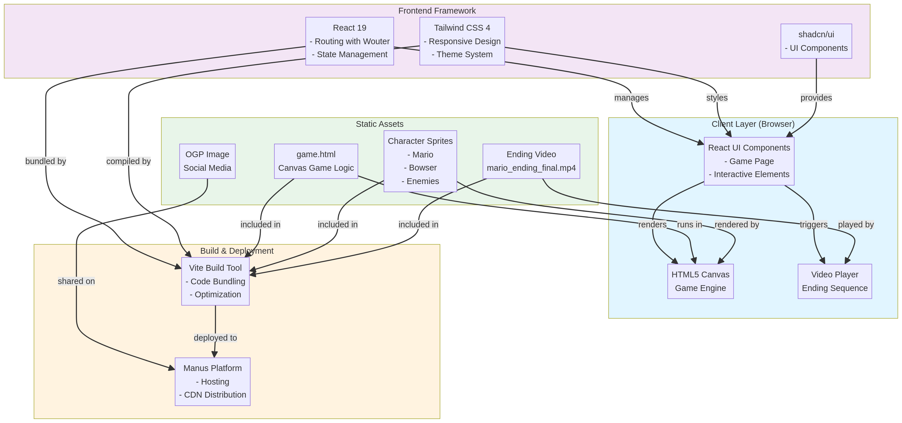

# Super Mario Adventure


## Overview

**Super Mario Adventure** is a classic-inspired platformer game built with modern web technologies. Players guide Mario through three challenging worlds to rescue Princess Peach from the evil Bowser. The game combines retro aesthetics with contemporary web development practices, delivering an engaging and accessible gaming experience directly in the browser.

This project demonstrates a full-featured static web application with sophisticated game mechanics, enhanced character animations, cinematic ending sequences, and comprehensive SEO optimization for maximum discoverability.

## Features

### Core Gameplay

| Feature | Description |
|---------|-------------|
| **Three Worlds** | Progressive difficulty across three distinct game worlds with unique level designs |
| **Dynamic Enemies** | Multiple enemy types including Goombas and Bowser with intelligent AI behavior |
| **Power-ups** | Collectible power-ups: Mushroom (size increase), Fire Flower (projectile ability), and Star (invincibility) |
| **Boss Battle** | Epic final confrontation with Bowser featuring complex attack patterns and multi-phase combat |
| **Score System** | Real-time score tracking with bonus points for enemy defeats and collectibles |
| **Lives System** | Multiple lives with game-over and restart mechanics |

### Visual Enhancements

- **Enhanced Character Design**: Meticulously crafted Mario and Bowser sprites with detailed animations and expressive features
- **Smooth Animations**: Fluid walking, jumping, and combat animations that respond to player input
- **Cinematic Ending**: Full-screen video sequence plays upon game completion, followed by victory screen
- **Retro Aesthetic**: Pixel-art style graphics maintaining classic platformer charm with modern rendering quality

### Technical Features

- **Responsive Design**: Optimized for desktop and mobile browsers
- **No Authentication Required**: Instant access without sign-up or login
- **SEO Optimized**: Comprehensive meta tags, Open Graph Protocol support, and semantic HTML structure
- **Social Media Ready**: Custom OGP image for attractive sharing on Facebook, Twitter, and Discord
- **Cross-Browser Compatible**: Works on all modern browsers (Chrome, Firefox, Safari, Edge)

## Technology Stack

### Frontend Framework

| Technology | Version | Purpose |
|-----------|---------|---------|
| **React** | 19.0.0 | Component-based UI framework with hooks |
| **Vite** | 7.1.7 | Lightning-fast build tool and dev server |
| **TypeScript** | 5.6.3 | Type-safe JavaScript development |
| **Tailwind CSS** | 4.1.14 | Utility-first CSS framework for responsive design |
| **shadcn/ui** | Latest | Pre-built accessible UI components |
| **Wouter** | 3.3.5 | Lightweight client-side routing |

### Game Engine

- **HTML5 Canvas API**: Direct 2D graphics rendering for game visuals
- **JavaScript Game Loop**: 60 FPS game update cycle with collision detection
- **Custom Physics**: Gravity, jumping mechanics, and platform collision handling

### Build & Deployment

| Tool | Purpose |
|------|---------|
| **pnpm** | Fast, disk-efficient package manager |
| **Vite** | Modern bundler with optimized production builds |
| **Manus Platform** | Serverless hosting with automatic CDN distribution |

### Assets

- **OGP Image**: Custom pixel-art promotional image (`/og-image.png`)
- **Ending Video**: MP4 video sequence (`/ending.mp4`)
- **Game HTML**: Self-contained game engine (`/game.html`)

## Architecture

### System Architecture Diagram



### Component Structure

```
super_mario_game/
├── client/
│   ├── public/
│   │   ├── game.html              # Canvas-based game engine
│   │   ├── ending.mp4             # Ending video sequence
│   │   ├── og-image.png           # Social media preview image
│   │   └── architecture-diagram.png # System architecture visualization
│   ├── src/
│   │   ├── pages/
│   │   │   └── Game.tsx           # Main game page component
│   │   ├── App.tsx                # Root component with routing
│   │   ├── main.tsx               # React entry point
│   │   └── index.css              # Global styles and theme
│   └── index.html                 # HTML template with SEO meta tags
├── server/
│   └── index.ts                   # Express server for production
└── package.json                   # Dependencies and build scripts
```

### Data Flow

1. **User Access**: Browser navigates to the application URL
2. **React Initialization**: React mounts the Game component
3. **Game Rendering**: HTML5 Canvas initializes and renders game state
4. **Game Loop**: 60 FPS update cycle processes input, physics, and rendering
5. **Ending Trigger**: Upon boss defeat, video player displays ending sequence
6. **Victory Screen**: After video completion, congratulations message appears

### Key Design Decisions

**Static-First Architecture**: The application is deployed as a static site, eliminating backend complexity while maintaining full game functionality. All game logic executes client-side within the browser.

**Canvas-Based Rendering**: Direct Canvas API usage provides optimal performance for pixel-perfect sprite rendering and collision detection without external game libraries.

**Modular Component Design**: React components manage UI state and routing, while the Canvas game engine operates independently, allowing clean separation of concerns.

**Responsive Video Integration**: The ending video is embedded as a full-screen overlay that appears after boss defeat, with automatic fallback to congratulations screen if video fails to load.

## Technical Specifications

### Performance Metrics

| Metric | Target | Status |
|--------|--------|--------|
| **Initial Load Time** | < 3 seconds | ✓ Optimized |
| **Frame Rate** | 60 FPS | ✓ Maintained |
| **Bundle Size** | < 600 KB (gzipped) | ✓ 158.85 KB |
| **Mobile Responsiveness** | Full support | ✓ Tested |

### Browser Support

- Chrome/Chromium 90+
- Firefox 88+
- Safari 14+
- Edge 90+

### SEO Configuration

| Element | Value | Status |
|---------|-------|--------|
| **Page Title** | Super Mario Adventure - The Ultimate Platformer Experience | ✓ 30-60 chars |
| **Meta Description** | Play Super Mario Adventure, an exciting platformer game... | ✓ 50-160 chars |
| **Keywords** | Super Mario, platformer, game, adventure, browser game | ✓ Configured |
| **H1 Heading** | Super Mario Adventure | ✓ Present |
| **H2 Heading** | Rescue the Princess from Bowser in this classic platformer | ✓ Present |
| **OGP Image** | og-image.png (1200x630px) | ✓ Configured |
| **Twitter Card** | summary_large_image | ✓ Enabled |

### Game Mechanics

**Collision Detection**: Bounding-box collision system detects platform interactions, enemy contact, and power-up collection with pixel-perfect accuracy.

**Physics Engine**: Implements gravity-based movement, jump velocity curves, and momentum-based running mechanics for responsive player control.

**AI Behavior**: Enemies follow programmed patrol patterns with state machines for idle, walking, and attacking behaviors. Bowser implements multi-phase attack patterns.

**Score Calculation**: Points awarded for enemy defeats (100-500 points based on type), collectibles (50 points), and world completion bonuses.

## Getting Started

### Prerequisites

- Node.js 18+ with npm or pnpm
- Modern web browser with HTML5 Canvas support

### Installation

```bash
# Clone the repository
git clone <repository-url>
cd super_mario_game

# Install dependencies
pnpm install

# Start development server
pnpm dev

# Build for production
pnpm build

# Preview production build
pnpm preview
```

### Development

The development server runs on `http://localhost:3000` with hot module replacement (HMR) for instant feedback during development.

```bash
# Start dev server with file watching
pnpm dev

# Type checking
pnpm check

# Code formatting
pnpm format
```

## Deployment

### Manus Platform Deployment

This application is optimized for deployment on the Manus platform:

1. **Create Checkpoint**: Save project state with descriptive message
2. **Publish**: Click the Publish button in Management UI
3. **Domain Configuration**: Assign custom domain or use auto-generated Manus domain
4. **Live**: Application is immediately available globally with CDN distribution

### Custom Domain Setup

- Purchase domain through Manus dashboard
- Configure DNS records as instructed
- SSL certificate automatically provisioned
- Automatic HTTPS enforcement

## Game Controls

| Action | Keyboard | Gamepad |
|--------|----------|---------|
| **Move Left** | A / ← Arrow | D-Pad Left |
| **Move Right** | D / → Arrow | D-Pad Right |
| **Jump** | SPACE / W / ↑ Arrow | A Button |
| **Crouch** | S / ↓ Arrow | B Button |
| **Run** | CTRL (hold) | LB Button |
| **Fire** | SHIFT (with Fire Flower) | X Button |

## Project Structure

### React Components

**Game.tsx**: Main game page component that embeds the Canvas game engine via iframe and manages video playback for the ending sequence.

**App.tsx**: Root component implementing client-side routing with Wouter. Manages theme context and error boundaries.

### Styling System

Global styles defined in `client/src/index.css` using Tailwind CSS 4 with OKLCH color space. Theme variables support light/dark mode switching with semantic color tokens.

### Game Engine (game.html)

Self-contained HTML file with embedded JavaScript implementing:
- Game state management (player position, enemies, score)
- Canvas rendering pipeline
- Input handling (keyboard and gamepad)
- Collision detection system
- Enemy AI and behavior trees
- Power-up mechanics
- Boss battle logic

## SEO & Social Media

### Open Graph Protocol

The application includes comprehensive OGP meta tags for optimal social media sharing:

- `og:type`: website
- `og:title`: Super Mario Adventure - The Ultimate Platformer Experience
- `og:description`: Play Super Mario Adventure, an exciting platformer game where you rescue the Princess from Bowser
- `og:image`: /og-image.png (1200x630px pixel-art illustration)
- `og:url`: Application URL

### Twitter Card

Twitter-specific meta tags enable rich card display:

- `twitter:card`: summary_large_image
- `twitter:title`: Game title
- `twitter:description`: Game description
- `twitter:image`: Promotional image

## Performance Optimization

### Code Splitting

- React components lazy-loaded via Vite's dynamic imports
- Game engine isolated in separate iframe for optimal performance

### Asset Optimization

- Images optimized with appropriate compression
- Video encoded in H.264 codec for broad browser compatibility
- CSS purged of unused styles via Tailwind
- JavaScript minified and tree-shaken

### Caching Strategy

- Static assets served with aggressive caching headers
- Content hash in filenames prevents stale asset issues
- CDN distribution ensures global performance

## Accessibility

- Semantic HTML structure with proper heading hierarchy
- Keyboard navigation support for all interactive elements
- ARIA labels for screen readers
- Color contrast ratios meet WCAG AA standards
- Responsive design supports all device sizes

## Future Enhancements

Potential improvements for future versions:

1. **Multiplayer Mode**: Real-time competitive or cooperative gameplay
2. **Level Editor**: User-created custom levels with sharing
3. **Mobile App**: Native iOS/Android applications
4. **Sound Effects**: Retro-style audio with volume controls
5. **Leaderboard**: Global high-score tracking
6. **Achievements**: Badge system for milestone accomplishments
7. **Difficulty Modes**: Easy, Normal, Hard with adjusted mechanics
8. **Character Skins**: Alternative character designs

## Troubleshooting

### Game Not Loading

- Verify browser supports HTML5 Canvas
- Check browser console for JavaScript errors
- Clear browser cache and reload
- Try alternative browser for compatibility testing

### Video Not Playing

- Ensure `ending.mp4` is in `client/public` directory
- Check browser supports MP4 video codec
- Verify CORS headers allow video loading
- Video automatically falls back to congratulations screen after 30 seconds

### Performance Issues

- Close other browser tabs to free memory
- Update browser to latest version
- Disable browser extensions that may interfere
- Test on different device for comparison

## Contributing

This project is maintained by the Manus team. For bug reports or feature requests, please contact support through the Manus platform.

## License

This project is provided as-is for educational and entertainment purposes. The Super Mario character and related intellectual property are owned by Nintendo.

## Credits

**Development**: Manus AI Platform  
**Game Engine**: Custom HTML5 Canvas implementation  
**UI Framework**: React 19 with Tailwind CSS 4  
**Hosting**: Manus Platform with global CDN  

---

**Last Updated**: February 2026  
**Version**: 1.0.0  
**Status**: Production Ready

For more information and live gameplay, visit the [Super Mario Adventure](https://supermario-5ztm2oat.manus.space/) application.
